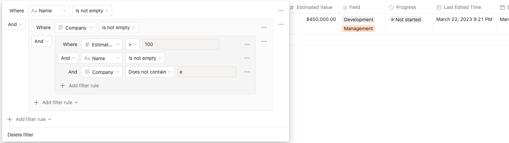
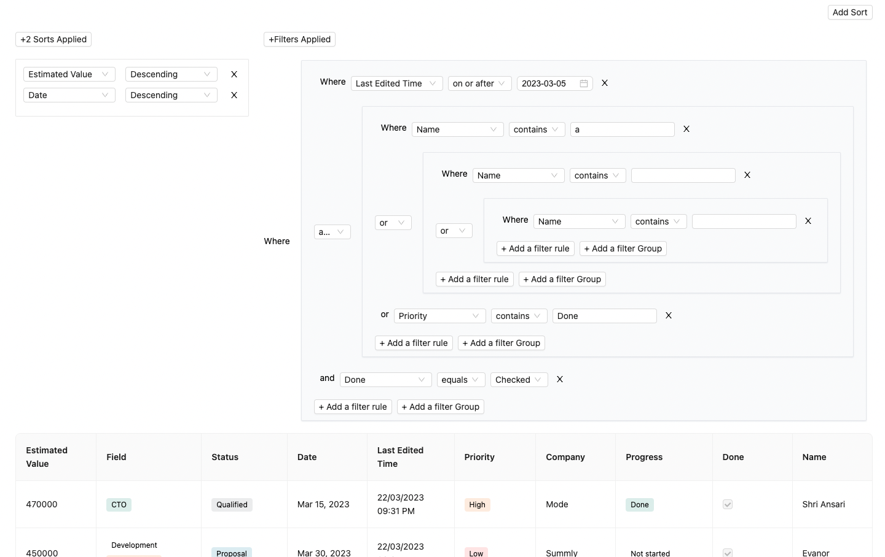

## [Notion CRM](https://notion-crm-view.vercel.app/)

A CRM that can render data from a Notion Database and perform complex functions extending Notion's out-of-the-box features such as compound filters and sorting.

## Installation

- Install dependecies with _yarn_ : `yarn`
- Run the development server : `yarn dev`
- Run the production server : `yarn build && yarn start`
- To lint and test the codebase with linters : `yarn test-all`

## Goal and Case Study

You can get a clearer picture with the feature pipeline below. In brief, in a Notion DB ( Table Database ) we have the ability to apply advanced filters and nested sorts.

When it comes to sorting, we have the same functionality as [nested sorts](https://developers.notion.com/reference/post-database-query-sort) in Notion.

For filters, the limitation here is that Notion only supports up to `2 depth` levels of nested filters. Our goal is to remove that and support `n` levels of depth filters.

Example from Notion:

This is how the current version looks like:

## Disclaimer and things to keep in mind

### Design System

Ant Design is used here as the design system. **This is utilized strictly only for building the UI elements faster and all the logical features are written in-house.**

### Bugs

As of now, there are bugs and these can be referenced under [Issues](https://github.com/Gurubalan-GIT/notion-crm/issues). This is still a work in progress, please feel free to create issue tickets for unraised bugs.

## Codebase Quality Control
- Pre-commit hooks via Husky.
  - This uses prettier and eslint configs together to setup linting when commiting.
- Github linters for automated commit annotations via [Github actions](https://github.com/Gurubalan-GIT/notion-crm/blob/main/.github/workflows/linter.yml).
  - This runs a linter action based on the prettier and eslint configs in the respective PR and lints the PR for a status check.
  

## Key Logics 

- [Memoized Filter [Side Effect]](./common/utils/helpers/memoizers.ts)
- [Memoized Sort [Side Effect]](./common/utils/helpers/memoizers.ts)
- [Nested State Update for Nested Filter Component](./common/utils/helpers/filters.ts)
- [HashMaps for making Column-Column Type-Type Specific Filters-Filter Actions easy](./common/utils/helpers/hashmaps.ts)

## State Management 

[RematchJS](https://rematchjs.org/) is used for state management.

## Feature Pipeline

- [x] Build a table view UI for Notion databases

  - [x] Implement a basic table view given a Notion database as input.
  - [x] Support sorting.
  - [x] Support rearrangement and resizing of columns - expected behavior:
    - [x] Click and hold the column headings to drag them left or right.
    - [x] Resize columns by hovering over their edges, and dragging right or left.

- [x] Build a Notion filter UI for supporting database filters.

  - [x] Support the property types `checkbox , date , multi_select , number , rich_text ,
select , timestamp , status`.
  - [x] Support Compound filters with filter groups.
  - [x] The Notion API doc notes that it only supports two levels of nesting on compound filter conditions. Implement the filters such that the restriction on the levels of nesting is configurable e.g. could be increased to 3, 4, or more.
  - [ ] Implement unit tests for the Compound filters

- [ ] Implement the NOT operator for compound filter conditions. Support compound filter conditions that contain only filter operators where the Notion API offers the logical negation e.g. `!(   )` is `is_not_empty` , `!( less_than )` is `greater_than_or_equal_to`
  - [ ] For the filter conditions where Notion does not offer the logical negation, implement validation logic that prompts the user that the NOT operator is unsupported with the given compound filter conditions.
  - [ ] For example: `!(( datePropertyX is after “2023-01-01” AND textPropertyY ends with “.com”) OR textPropertyZ starts with “www.”)` should indicate “Unsupported conditions for `NOT: ends with , starts with`
  - [ ] Include unit test cases for the NOT operator logic
